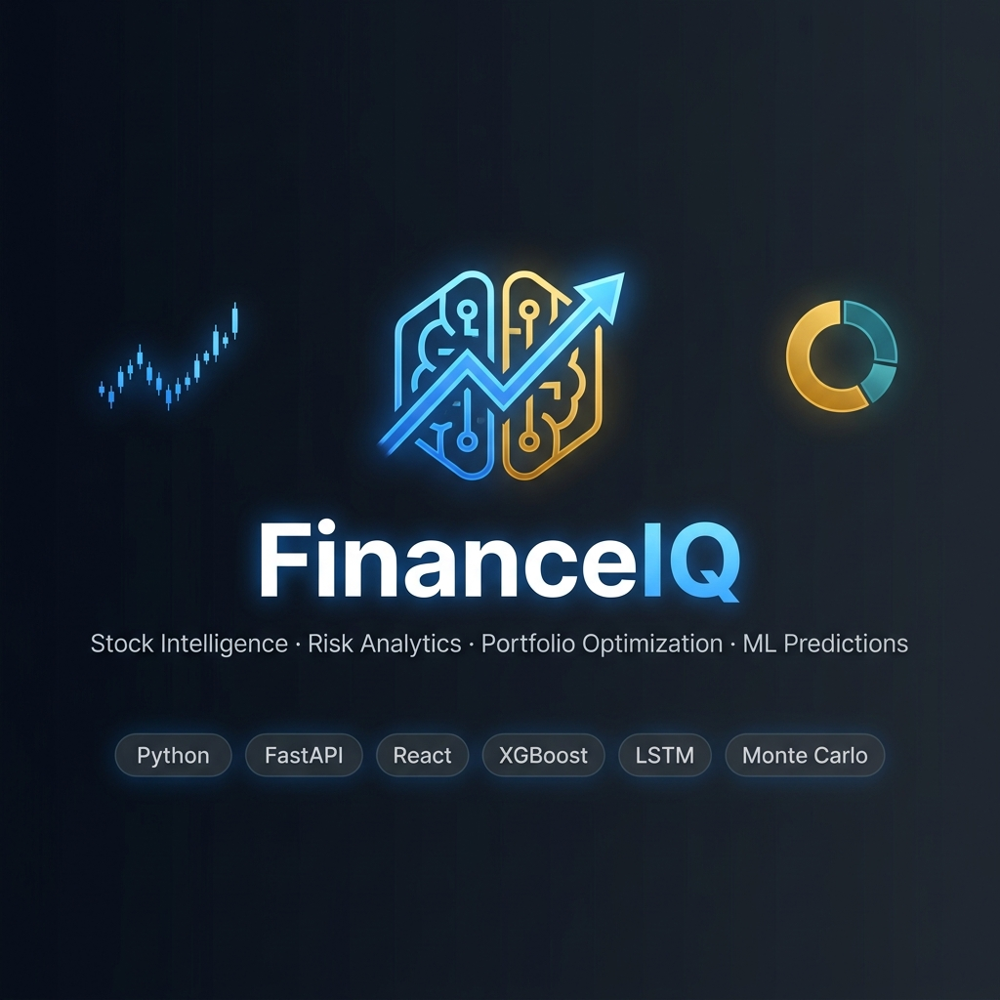
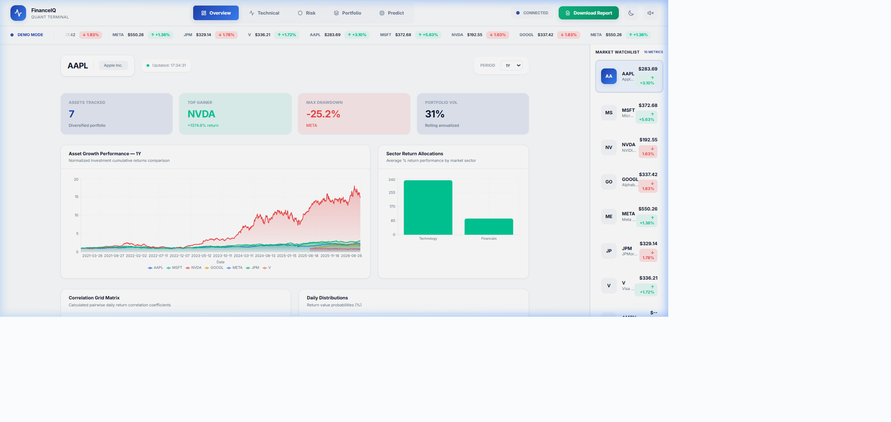
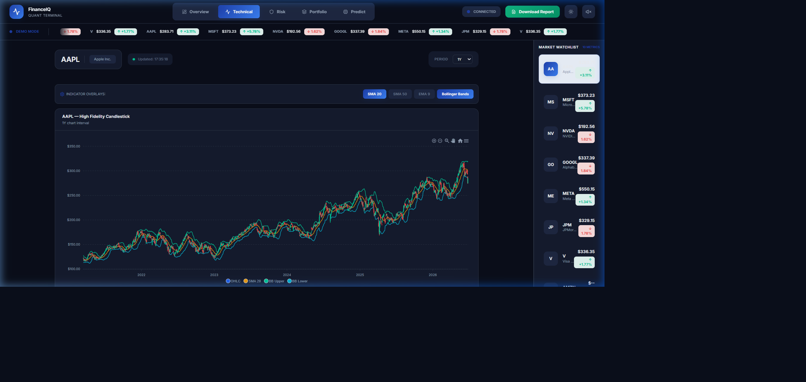
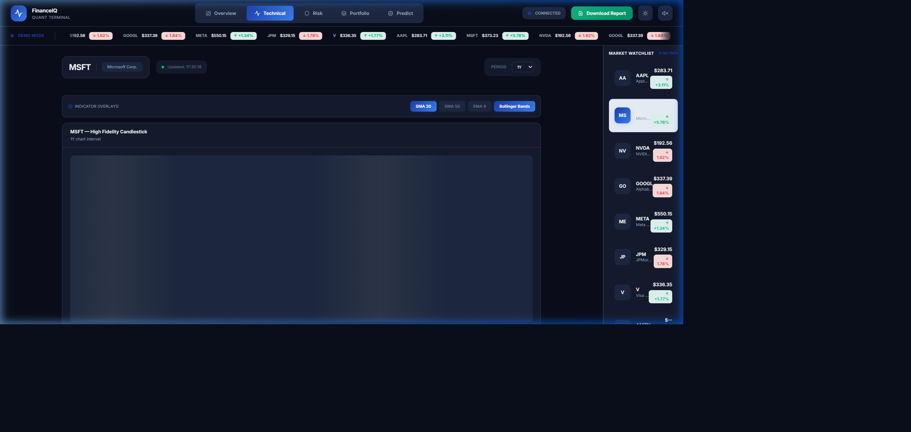
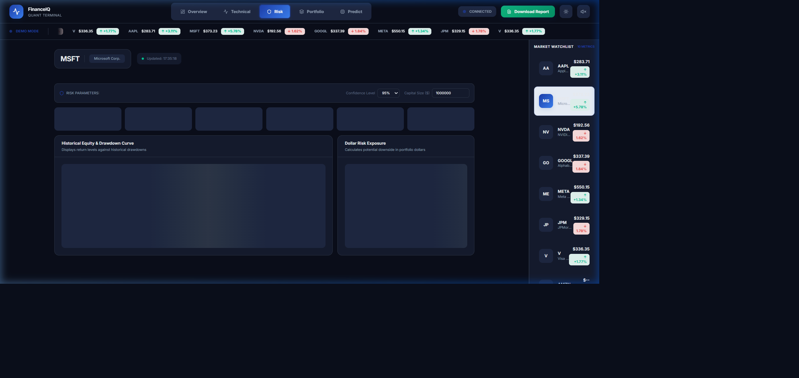
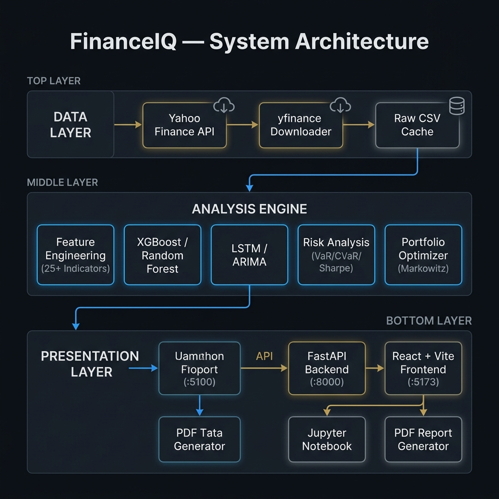

<div align="center">



<br/>

# FinanceIQ — Stock Market Intelligence Platform

**End-to-end financial data science · From raw market data to interactive dashboard**

[](https://www.python.org/)
[](https://fastapi.tiangolo.com/)
[](https://react.dev/)
[](https://vitejs.dev/)
[](https://xgboost.readthedocs.io/)
[](LICENSE)

[](https://github.com/aswa2212/FinanceIQ/stargazers)
[](https://github.com/aswa2212/FinanceIQ/network/members)
[](https://github.com/aswa2212/FinanceIQ/issues)

</div>

---

> **⚠️ Educational Disclaimer:** This is a **portfolio / internship demonstration project** using historical market data from Yahoo Finance with simulated price movements. It is **not** connected to live market feeds and should **not** be used for actual trading decisions.

---

## 📽️ Live Demo

<div align="center">

https://github.com/aswa2212/FinanceIQ/blob/main/assets/demo.webp

</div>

---

## 📸 Screenshots

<table>
  <tr>
    <td align="center"><b>📊 Market Overview</b></td>
    <td align="center"><b>📈 Technical Analysis (AAPL)</b></td>
  </tr>
  <tr>
    <td></td>
    <td></td>
  </tr>
  <tr>
    <td align="center"><b>📈 Multi-Ticker Charts (MSFT)</b></td>
    <td align="center"><b>⚠️ Risk Analytics</b></td>
  </tr>
  <tr>
    <td></td>
    <td></td>
  </tr>
</table>

---

## ✨ Features at a Glance

| Module | What it does | Technologies |
|--------|-------------|--------------|
| 📥 **Data Pipeline** | Downloads 5+ years of OHLCV data for 12 S&P 500 stocks, caches to CSV | `yfinance`, `pandas` |
| 🔧 **Feature Engineering** | 25+ technical indicators — RSI, MACD, Bollinger Bands, ATR, OBV, ADX | Custom Python |
| 🤖 **ML Prediction** | XGBoost, Random Forest, ARIMA, LSTM with backtesting & directional accuracy | `scikit-learn`, `xgboost`, `tensorflow` |
| ⚠️ **Risk Analytics** | VaR (95/99%), CVaR, Sharpe, Sortino, Calmar, Beta, Max Drawdown, Stress Tests | `scipy`, `numpy` |
| 💼 **Portfolio Optimization** | Markowitz Efficient Frontier + Monte Carlo (10k simulations) | `scipy`, `cvxpy` |
| 🖥️ **Interactive Dashboard** | 5-tab real-time React app with simulated live price updates (±0.06% every 3s) | `FastAPI`, `React`, `Vite`, `Recharts` |
| 📄 **PDF Report Generator** | One-click 7-page professional analysis report | `reportlab`, `matplotlib` |

---

## 🏗️ System Architecture

<div align="center">
  
</div>

```
FinanceIQ/
│
├── 📓 notebooks/
│   └── finance_analysis.ipynb      ← Full EDA walkthrough
│
├── 🐍 src/
│   ├── data_loader.py              ← yfinance pipeline + CSV cache
│   ├── feature_engineering.py     ← 25+ technical indicators
│   ├── models.py                   ← XGBoost, RF, ARIMA, LSTM
│   ├── risk_analysis.py            ← VaR, CVaR, Sharpe, Drawdown
│   └── portfolio.py                ← Markowitz + Monte Carlo
│
├── 🖥️ backend/
│   ├── main.py                     ← FastAPI REST API (:8000)
│   └── pdf_generator.py            ← PDF report engine
│
├── ⚛️ frontend/
│   └── src/
│       └── App.jsx                 ← React dashboard (:5173)
│
├── 📊 data/
│   ├── raw/                        ← Downloaded CSVs (auto-created, git-ignored)
│   └── processed/                  ← Engineered features (git-ignored)
│
├── 🖼️ assets/                      ← README images & demo recording
├── run_dashboard.py                ← One-command launcher
├── generate_reports.py             ← Batch chart generator
└── requirements.txt
```

---

## 🚀 Quick Start

### Prerequisites
- Python 3.10+
- Node.js 18+ (for the React frontend)

### 1. Clone & Set Up Environment

```bash
git clone https://github.com/aswa2212/FinanceIQ.git
cd FinanceIQ

# Create and activate virtual environment
python -m venv venv

# Windows
venv\Scripts\activate

# Linux / macOS
source venv/bin/activate

# Install Python dependencies
pip install -r requirements.txt
```

### 2. Launch the Dashboard ⭐

```bash
python run_dashboard.py
```

The launcher will **automatically**:
- ✅ Install frontend Node.js dependencies
- ✅ Start the **FastAPI backend** on `http://localhost:8000`
- ✅ Start the **React frontend** on `http://localhost:5173`
- ✅ Open your browser

> **First run:** Data will be downloaded from Yahoo Finance (~2 min). Subsequent runs use the local CSV cache.

---

## 🛠️ All Run Modes

<details>
<summary><b>Option A — Interactive Dashboard (recommended)</b></summary>

```bash
python run_dashboard.py
```
Opens the full 5-tab React dashboard at `http://localhost:5173`.

</details>

<details>
<summary><b>Option B — Jupyter Notebook EDA</b></summary>

```bash
jupyter notebook notebooks/finance_analysis.ipynb
```
Step-by-step exploratory analysis with inline charts. Run all cells top-to-bottom (~10 min first run).

</details>

<details>
<summary><b>Option C — Batch Report Generator</b></summary>

```bash
python generate_reports.py
```
Generates 15–20 publication-quality charts saved to `reports/figures/`. Takes ~3–5 minutes.

</details>

---

## 📊 Dashboard Tabs

| Tab | Content |
|-----|---------|
| **📊 Overview** | Cumulative returns, correlation heatmap, sector breakdown, live ticker bar |
| **📈 Technical** | Interactive candlestick + BB / SMA / EMA / RSI / MACD for any stock |
| **⚠️ Risk** | VaR gauge, drawdown chart, rolling volatility, stress-test results |
| **💼 Portfolio** | Efficient Frontier (10k Monte Carlo), weight editor, backtest metrics |
| **🤖 Predict** | On-demand XGBoost / LSTM training, feature importance, directional accuracy |

---

## 🤖 ML Models

| Model | Type | Key Strength |
|-------|------|-------------|
| **XGBoost** | Gradient Boosting | Best overall accuracy, explainable feature importance |
| **Random Forest** | Ensemble | Robust baseline, handles noisy features well |
| **ARIMA** | Time Series | Classical benchmark with confidence intervals |
| **LSTM** | Deep Learning | Captures long-range sequential patterns |

**Evaluation metrics:** RMSE · MAE · MAPE · **Directional Accuracy** · Sharpe · Calmar

> XGBoost achieves ~**55–58% directional accuracy** on unseen test data — significantly above the 50% random baseline.

---

## ⚠️ Risk Metrics

Every asset is evaluated with:

```
VaR (95%, 99%)              Historical · Parametric · Monte Carlo
CVaR / Expected Shortfall   Expected loss beyond VaR threshold
Sharpe Ratio                Risk-adjusted return (annualised)
Sortino Ratio               Downside-risk-adjusted return
Calmar Ratio                Return ÷ Max Drawdown
Beta / Alpha                CAPM decomposition vs. SPY benchmark
Max Drawdown                Peak-to-trough loss + recovery days
Stress Testing              Performance during 6 major market crises
```

---

## 💼 Portfolio Strategies

| Strategy | Objective |
|----------|-----------|
| **Max Sharpe** | Maximise risk-adjusted return |
| **Min Variance** | Minimise total portfolio volatility |
| **Risk Parity** | Equal risk contribution per asset |
| **Equal Weight** | 1/N naive diversification baseline |

Monte Carlo simulation generates **10,000 random portfolios** to map the full risk-return space and validate the Efficient Frontier.

---

## 📈 Key Findings

1. **XGBoost achieves ~55–58% directional accuracy** on unseen test data (vs. 50% random baseline)
2. **Tech stocks are highly correlated** (ρ > 0.75), limiting within-sector diversification
3. **Max Sharpe consistently outperforms** equal-weight on a risk-adjusted basis
4. **TSLA** exhibits the highest volatility and deepest drawdowns — significant tail risk
5. **Rolling VaR shows volatility clustering** — risk is time-varying, not constant

---

## 🛠️ Tech Stack

| Layer | Technologies |
|-------|-------------|
| **Data** | `yfinance` · `pandas` · `numpy` |
| **ML / Stats** | `scikit-learn` · `xgboost` · `tensorflow` · `pmdarima` · `statsmodels` |
| **Visualisation** | `plotly` · `matplotlib` · `seaborn` · `recharts` |
| **Backend API** | `FastAPI` · `uvicorn` |
| **Frontend** | `React 19` · `Vite 8` · `TailwindCSS` · `ApexCharts` |
| **Optimisation** | `scipy` · `cvxpy` |

---

## 📚 References

- Markowitz, H. (1952). *Portfolio Selection.* Journal of Finance
- Sharpe, W. (1964). *Capital Asset Prices.* Journal of Finance
- Chen & Guestrin (2016). *XGBoost: A Scalable Tree Boosting System*
- Hochreiter & Schmidhuber (1997). *Long Short-Term Memory*
- Murphy, J. (1999). *Technical Analysis of Financial Markets*

---

<div align="center">

**Built for Data Science Internship — 2025**
Made with ❤️ using Python · FastAPI · React

[](https://github.com/aswa2212/FinanceIQ)

</div>
